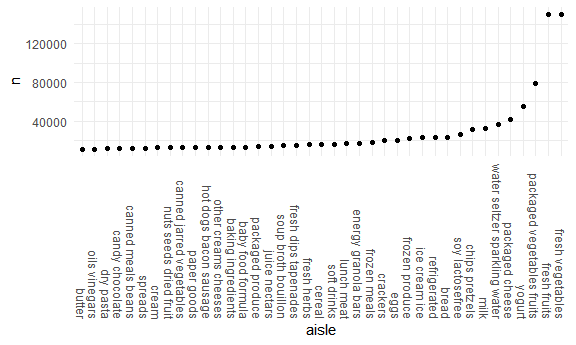

Homework 3 solutions
================
Matthew Angulo
October 10, 2020

## Problem 1

``` r
data("instacart") 
```

This dataset contains 1384617 rows and 15 columns

Observations are at the level of items in orders by user. There are user
/ order variables – user ID, order ID, order day, and order hour. There
are also item variables – name, aisle, department, and some numeric
codes.

How many aisles, and which are most items from?

``` r
instacart %>% 
  count(aisle) %>% 
  arrange(desc(n))
```

    ## # A tibble: 134 x 2
    ##    aisle                              n
    ##    <chr>                          <int>
    ##  1 fresh vegetables              150609
    ##  2 fresh fruits                  150473
    ##  3 packaged vegetables fruits     78493
    ##  4 yogurt                         55240
    ##  5 packaged cheese                41699
    ##  6 water seltzer sparkling water  36617
    ##  7 milk                           32644
    ##  8 chips pretzels                 31269
    ##  9 soy lactosefree                26240
    ## 10 bread                          23635
    ## # ... with 124 more rows

Let’s make a plot

``` r
instacart %>% 
  count(aisle) %>% 
  filter(n >10000) %>% 
  mutate(
    aisle = factor(aisle),
    aisle = fct_reorder(aisle, n)
  ) %>% 
  ggplot(aes(x = aisle, y = n))+
  geom_point()+
  theme(axis.text.x = element_text(angle = 270, vjust = 0.5, hjust=1))
```



Let’s make a table\!

``` r
instacart %>% 
  filter(aisle %in% c("baking ingredients", "dog food care", "packaged vegetables fruits")) %>% 
  group_by(aisle) %>% 
  count(product_name) %>% 
  mutate(rank = min_rank(desc(n))) %>% 
  filter(rank < 4) %>% 
  arrange(aisle, desc(n)) %>% 
  knitr::kable()
```

| aisle                      | product\_name                                 |    n | rank |
| :------------------------- | :-------------------------------------------- | ---: | ---: |
| baking ingredients         | Light Brown Sugar                             |  499 |    1 |
| baking ingredients         | Pure Baking Soda                              |  387 |    2 |
| baking ingredients         | Cane Sugar                                    |  336 |    3 |
| dog food care              | Snack Sticks Chicken & Rice Recipe Dog Treats |   30 |    1 |
| dog food care              | Organix Chicken & Brown Rice Recipe           |   28 |    2 |
| dog food care              | Small Dog Biscuits                            |   26 |    3 |
| packaged vegetables fruits | Organic Baby Spinach                          | 9784 |    1 |
| packaged vegetables fruits | Organic Raspberries                           | 5546 |    2 |
| packaged vegetables fruits | Organic Blueberries                           | 4966 |    3 |

Apples vs ice cream

``` r
instacart %>% 
  filter(product_name %in% c("Pink Lady Apples", "Coffee Ice Cream")) %>% 
  group_by(product_name, order_dow) %>%
  summarize(mean_hour = mean(order_hour_of_day)) %>% 
  pivot_wider(
    names_from = order_dow,
    values_from = mean_hour
  )
```

    ## `summarise()` regrouping output by 'product_name' (override with `.groups` argument)

    ## # A tibble: 2 x 8
    ## # Groups:   product_name [2]
    ##   product_name       `0`   `1`   `2`   `3`   `4`   `5`   `6`
    ##   <chr>            <dbl> <dbl> <dbl> <dbl> <dbl> <dbl> <dbl>
    ## 1 Coffee Ice Cream  13.8  14.3  15.4  15.3  15.2  12.3  13.8
    ## 2 Pink Lady Apples  13.4  11.4  11.7  14.2  11.6  12.8  11.9

## Question 2

``` r
accel_df = read_csv("./data/accel_data.csv") %>% 
  janitor::clean_names() %>% 
  mutate(
    day = factor(day, levels = c("Monday", "Tuesday", "Wednesday", "Thursday", "Friday", "Saturday", "Sunday")
  )) %>% 
  arrange(day, week) %>% 
  pivot_longer(
    activity_1:activity_1440,
    names_to = "minute",
    names_prefix = "activity_",
    values_to = "activity_count"
  ) %>% 
  mutate(
    weekday_weekend = case_when(
      day %in% c("Saturday", "Sunday") ~ "weekend",
      day %in% c("Monday", "Tuesday", "Wednesday", "Thursday", "Friday") ~ "weekday",
      TRUE ~ "")
  ) %>% 
  mutate(
     weekday_weekend = factor(weekday_weekend),
     minute = as.numeric(minute)
  ) %>% 
  relocate(week, day_id, day, weekday_weekend)
```

    ## Parsed with column specification:
    ## cols(
    ##   .default = col_double(),
    ##   day = col_character()
    ## )

    ## See spec(...) for full column specifications.

``` r
accel_df
```

    ## # A tibble: 50,400 x 6
    ##     week day_id day    weekday_weekend minute activity_count
    ##    <dbl>  <dbl> <fct>  <fct>            <dbl>          <dbl>
    ##  1     1      2 Monday weekday              1              1
    ##  2     1      2 Monday weekday              2              1
    ##  3     1      2 Monday weekday              3              1
    ##  4     1      2 Monday weekday              4              1
    ##  5     1      2 Monday weekday              5              1
    ##  6     1      2 Monday weekday              6              1
    ##  7     1      2 Monday weekday              7              1
    ##  8     1      2 Monday weekday              8              1
    ##  9     1      2 Monday weekday              9              1
    ## 10     1      2 Monday weekday             10              1
    ## # ... with 50,390 more rows

This dataset

Pivot longer, havnig something for activity count and minute, add
variable with mutate, reasonable order and names,

``` r
accel_df %>% 
  group_by(week, day) %>% 
  summarize(total = sum(activity_count)) %>% 
  knitr::kable()
```

    ## `summarise()` regrouping output by 'week' (override with `.groups` argument)

| week | day       |     total |
| ---: | :-------- | --------: |
|    1 | Monday    |  78828.07 |
|    1 | Tuesday   | 307094.24 |
|    1 | Wednesday | 340115.01 |
|    1 | Thursday  | 355923.64 |
|    1 | Friday    | 480542.62 |
|    1 | Saturday  | 376254.00 |
|    1 | Sunday    | 631105.00 |
|    2 | Monday    | 295431.00 |
|    2 | Tuesday   | 423245.00 |
|    2 | Wednesday | 440962.00 |
|    2 | Thursday  | 474048.00 |
|    2 | Friday    | 568839.00 |
|    2 | Saturday  | 607175.00 |
|    2 | Sunday    | 422018.00 |
|    3 | Monday    | 685910.00 |
|    3 | Tuesday   | 381507.00 |
|    3 | Wednesday | 468869.00 |
|    3 | Thursday  | 371230.00 |
|    3 | Friday    | 467420.00 |
|    3 | Saturday  | 382928.00 |
|    3 | Sunday    | 467052.00 |
|    4 | Monday    | 409450.00 |
|    4 | Tuesday   | 319568.00 |
|    4 | Wednesday | 434460.00 |
|    4 | Thursday  | 340291.00 |
|    4 | Friday    | 154049.00 |
|    4 | Saturday  |   1440.00 |
|    4 | Sunday    | 260617.00 |
|    5 | Monday    | 389080.00 |
|    5 | Tuesday   | 367824.00 |
|    5 | Wednesday | 445366.00 |
|    5 | Thursday  | 549658.00 |
|    5 | Friday    | 620860.00 |
|    5 | Saturday  |   1440.00 |
|    5 | Sunday    | 138421.00 |

Aggregrate with group by week and then day and summarize with mean or
sum to end up with table with 35 days and activity count for each of
those days. Make table easier to read with week number and day of the
week. Trends apparent that just point out busy weeks or slow weeks Day
of the week is gonna be in alpha order so need to use factors to reorder

``` r
accel_df %>% 
  ggplot(aes(x = minute, y =activity_count, color = day))+
  geom_line()
```


Little activity during 500 - 1200 minutes especially during work week

Make a plot. Want to see activity at each minute of each day. Minute on
x and activity count on y. Scatterplot wont work. geom\_line is a little
bit better. Aesthetic mapping for color = day of week. Is minute of the
day a numeric or factor or character?

## Question 3

``` r
library(p8105.datasets)
data("ny_noaa")

view(ny_noaa)
```

Separate y-m-d into year and month and day variables. Convert prcp and
snowfall to an easier to comprehend value range. use count to find most
common

Group by station, year, and month and summarize to get max temp. Filter
at some point, either way it will wrok Plot. Facet to get two panels

use patchwork to combine plots. First one could be hex plot or contour
plot instead of scatterplot. For second filter first, and then use
boxplot, ridge plot, violin plot
